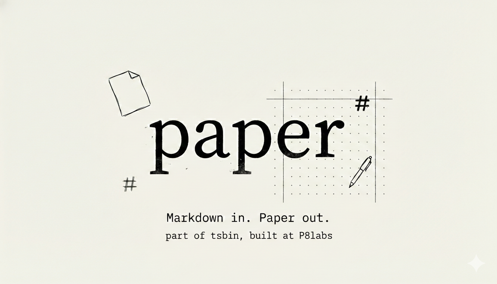

# tsbin paper



**Markdown in. Paper out.**

A minimal tool to turn Markdown into beautiful images or publish it permanently on IPFS.

## Features

- Live Markdown editor with syntax highlighting
- Multiple themes (Paper, Dark, Terminal, Sepia, Nord)
- Custom font options (Serif, Sans, Mono)
- Export as PNG image
- Export as standalone HTML
- Auto-save to localStorage
- Publish to IPFS (coming soon)

## Quick Start

```sh
# install dependencies
pnpm install

# start dev server
pnpm dev

# build for production
pnpm build
```

## Tech Stack

- SvelteKit + Svelte 5
- TailwindCSS
- markdown-it + highlight.js
- html2canvas

---

Part of the [tsbin.tech](https://tsbin.tech) tool collection by P8labs.
